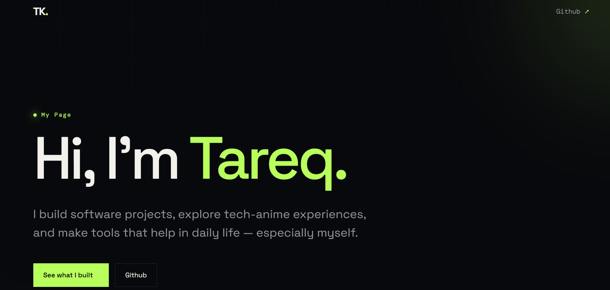
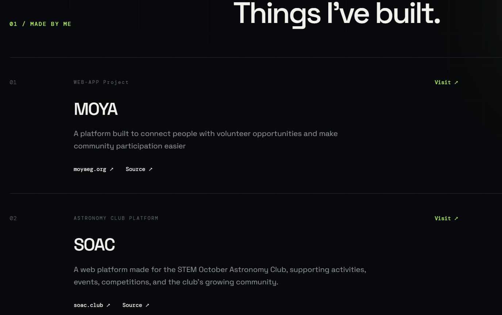
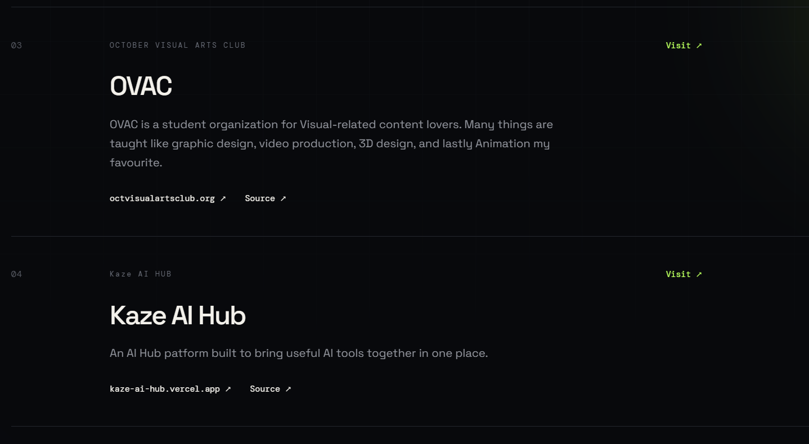
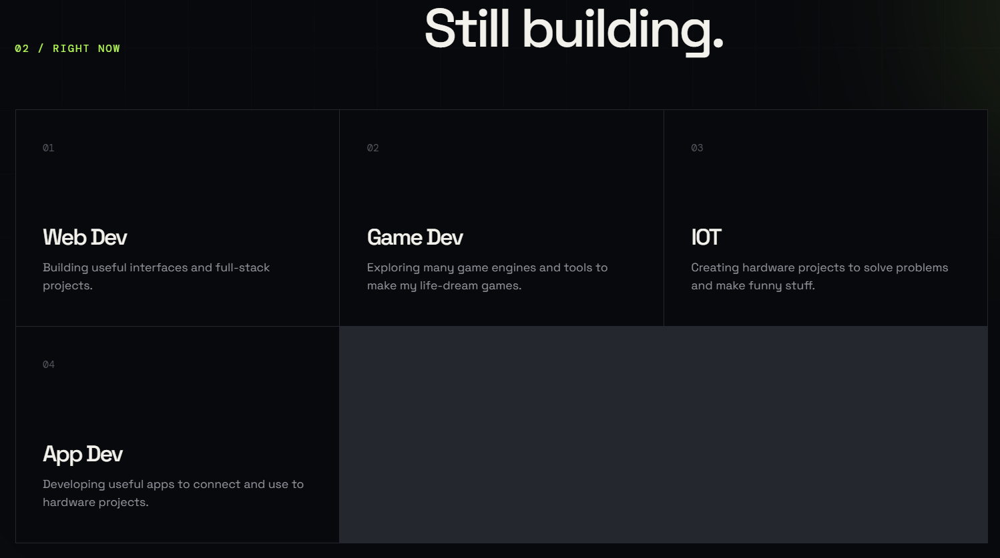
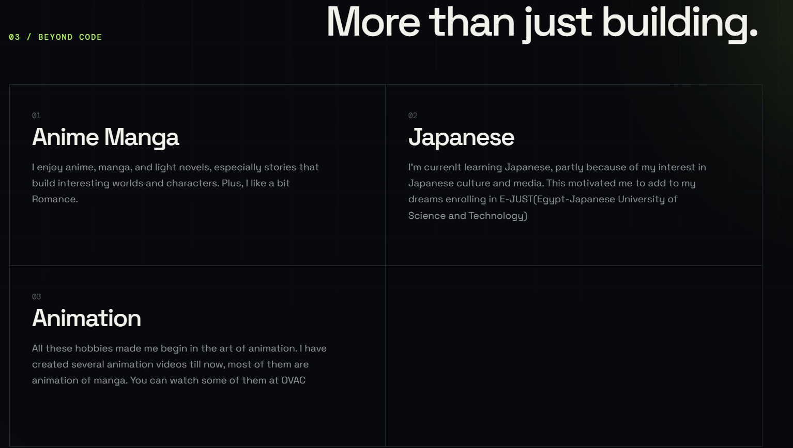
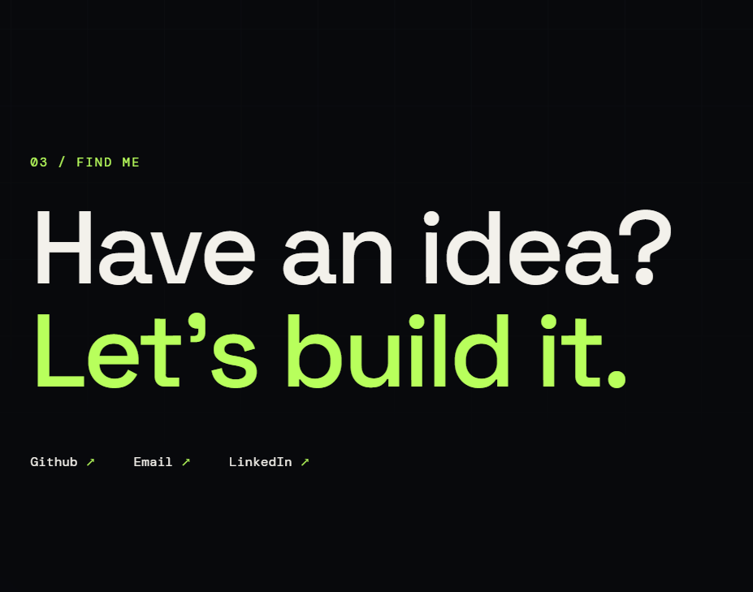

# tls123's info

A personal page created for my restoration builder trial

## Description

This is a simple personal page where I talk a bit about myself, some of the projects I've worked on, and what I'm currently working on.
It includes projects like MOYA, SOAC, OVAC, and Kaze AI Hub, along with a section about some of my hobbies. I'm especially into anime, manga, and light novels, so if you want recommendations, feel free to ask.

### Screenshots








## Running the Project

### Requirements

You only need:

* A modern web browser.
* An internet connection if you want the Google Fonts to load.

There aren't any packages or dependencies to install. It's just HTML and CSS.
### Installing

* Clone the repo:

```bash
git clone https://github.com/Tareq-Khalil/Builder-Info.git
```

* Then move into the project folder:

```bash
cd Builder-Info
```

* That's it. There's nothing else to install.

### Executing program

* The easiest way is to open `index.html` directly in your browser.

If you're using VS Code, you can also use Live Server:

1. Open the project in VS Code.
2. Open `index.html`.
3. Right-click it.
4. Select **Open with Live Server**.
The page should open in your browser.

## Help

If the website does not display correctly:

* Make sure `index.html` and `style.css` are in the correct locations.
* Check your internet connection if the Google Fonts are not loading.

## License

This project is licensed under the [MIT License](LICENSE)
